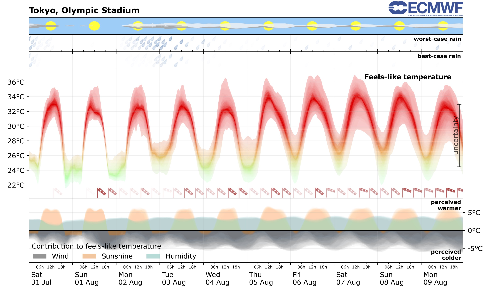

[Karsten](https://www.medicalschool-hamburg.de/ueber-uns/team/team-fakultaet-medizin/karsten-hollander/)
said `machen wir eigentlich wieder Heat Prediction?` (are we doing heat prediction again?),
[Milan](https://milankl.github.io) answered `Könnten wir` (we could).
Given you are reading this, the answer is *yes*.

## Tokyo 2020 Olympics

For the Olympic Games in Tokyo 2021 (moved from 2020) we post-processed the weather
forecasts from the European Centre for Medium-Range Weather Forecasts ([ECMWF](https://ecmwf.int))
to provide a more heat-related forecast and posted this daily on Twitter
[@HeatForecast](https://twitter.com/HeatForecast). The meteograms presented
the universal thermal climate index (UTCI) as a feels-like temperature more 
relevant to the human physiology quantifying the heat stress a human would experience
outside. The meteograms also presented the contribution to the feels-like
temperature. How much hotter it would feel if exposed to sunlight, or due to humidity,
or how much wind would reduce the heat stress. The meteograms looked like this

For more information see

- Klöwer, M, P Edouard, AM Niess, S Racinais, Y Pitsiladis, F Pappenberger and K Hollander, 2023. Forecasting feels-like temperatures to reduce heat illnesses during sport events, British Journal of Sports Medicine, [10.1136/bjsports-2022-106413](http://dx.doi.org/10.1136/bjsports-2022-106413)

(If you cannot access this publication but you would like to sent me an email).
For the Paris Olympics in 2024 we are resuming this project, hosted on
[heatforecast.github.io](https://heatforecast.github.io)
More background information in the following as well as in the
[meteogram explanation](https://heatforecast.github.io/explanation).

## Feels-like temperatures

Outdoor activities in summer months, and generally in hotter regions of the world, humans
are exposed to heat. The heat stress on the human body, depending on acclimatisation
and many other factors can cause dehydration, other heat illnesses and even death.
Many people die every year in heat waves around the world. And with climate change it is
getting worse, many regions of the world are predicted to become essentially
uninhabitable due to a combination of unbearably air temperatures and humidities.

The heat stress a human body experiences depends on more than just the air temperature
which is widely presented in weather forecasts. Higher humidity levels limit the body's
ability to sweat and therefore lose energy. Higher winds however increase evaporation
and makes sweating more effective but also transports air away from the body.
As long as the air temperature is below body temperature that is a heat transport
cooling you down. Then there's also radiation: Even if air temperatures are below
freezing, sunshine will increase the experienced temperatures in which case the
feels-like temperature can be 10˚C or more above the air temperature.

## Weather forecasts

Most weather forecasts present *air* temperatures, because that's physically easier to
measure and predict. In some regions or seasons however, forecasts also communicate
quantities like the "heat index" (including the effect of humidity), "windchill" 
(including the effect of high winds). You may have heard about the
wet-bulb globe temperature (WBGT), which combines these and also includes the
effect of radiation. However, it essentially assumes the human to be a
small black sphere, smaller than a tennis ball, that's wearing soaking wet clothes
standing in the wind.

We want to go one step further and always communicate as the feels-like temperature
the "universal thermal climate index" (UTCI) which is based on the heat budget
analysis of a (standardized) human to actually quantify a feels-like temperature
as the equivalent air temperature that causes the same heat stress on the human body.

## Why Olympics?

Heatwaves, and in many cases also shorter exposure to heat, can cause dehydration,
other heat illnesses, heat strokes or even death. Many heatwaves cause excess mortality
but it is difficult to quantify less severe impacts of heatwaves on public health.
During the Olympics, and generally outdoor competitions with professional athletes,
a large group of people is under regular medical observation with physicians also
tracking less severe symptoms. Even though professional athletes are by definition
not representative members of the public in terms of physiology and health,
this does allow us to conduct studies on the impacts of heat on humans. See also
[Hollander et al., 2021](https://doi.org/10.1111/sms.14029) and
[Klöwer et al., 2023](http://dx.doi.org/10.1136/bjsports-2022-106413).

## Why only Olympics?

We would love to extend [heatforecast.github.io](https://heatforecast.github.io)
more generally to various places at any time of the year. However, this
heat forecast is currently an experimental project, showcasing possibilities to
improve weather forecasts towards physiologically relevant information
and intuitive visualisation. Given the public attention we decided to run this
second pilot after Tokyo 2020 but we will likely stop it at some point after
the Paralympic Games. If you are interested to run this heat forecast more
operationally or to integrate it into other operational forecasts place
reach out. With additional resources this might be possible.