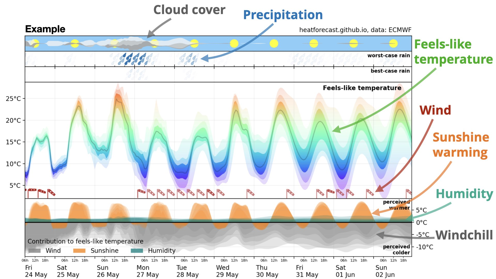

The following explains the heatforecast meteogram in more detail

## Uncertainty

To measure uncertainty, the heat forecast is not based on a single forecast,
but on ECMWF's ensemble prediction system, which runs 50 different forecasts
covering the range of possible weather over the next 10 days. If 10 ensemble
members simulate a storm but 40 do not, then there's a 20% chance of this
storm to occur. For every variable like temperature or wind, we calculate
the minimum, 10th, 25th, 50th (median), 75th, 90th percentile and the maximum
across the distribution of the 50 ensemble members. Wider distributions
with a larger difference between minimum and maximum or between th 10th
and 90th percentile (the decile range) are less certain. For narrow
distributions, more typical in the first days of a forecast,
all 50 simulations basically agree what is going to happen, providing
high certainty.

## Spatial resolution

The heat forecast meteogram is based on a global resolution of about
9km. We chose the location [48.82°N and 2.29°E](https://maps.app.goo.gl/pzkHqZnJNyrXKydS6),
just south of the périphérique close to the Vanves-Malakoff train station,
of the global grid to be representative for Paris. But local differences
remain especially in urban areas, which we cannot resolve.

## Temporal resolution

The meteogram shows hourly data for the first three days then decreasing to
3-hourly data before further decreasing to 6-hourly data on day 7 of the
forecast. For visualisation purposes we use a spline interpolation to avoid
a counter-intuitive and physically unreasonable linear interpolation
between long time steps. As a result, the feels-like temperatures are
very sinusoidal on day 7 to 10 of the forecast.

## Clouds

In the top panel cloud cover is visualised. Clouds are classified as
low (dark grey), medium (grey), and high (light grey), depending on their height
in the atmosphere. Higher cloud covers (measured in fraction of sky) are visualised
with thicker clouds here. Yellow suns (why yellow?) are added on every day at noon
for orientation. We use the median of the forecast ensemble and do not visualise
uncertainty.

## Precipitation

Precipitation (or rain) is visualised in a worst-case (meaning higher precipitation)
and best-case (lower precipitation) category. The worst-case is the 90th percentile
of precipitation in the ensemble forecast meaning the amount of precipitation
in the highest 5 out of 50 forecasts. The best-case is the 25th percentile.
For every hour the amount of precipitation is visualised by more (=less rain) or
less (=more rain) transparent rain drops. Their vertical position has no meaning
and is chosen for aesthetic purposes only. 

## Feels-like temperature

## Wind

## Contribution to feels-like temperature

